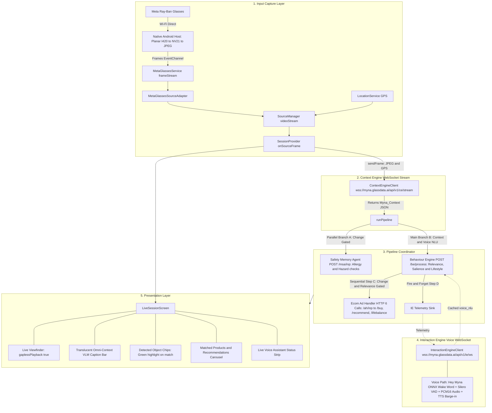

# Meta Ray-Ban Smart Glasses Integration & Complete 5-Engine Pipeline Flow

This document details the architecture and verified execution flow of the **Meta Ray-Ban Smart Glasses (MWDAT SDK 0.9.0)** operating seamlessly across the **SmartPoc 5-Engine AI Pipeline**.

---

## 🗺️ Complete End-to-End Pipeline Architecture



---

## 📐 Text Flow Diagram

```text
+-----------------------------------------------------------------------------------+
| 1. INPUT CAPTURE LAYER                                                            |
|    Meta Ray-Ban Glasses (Wi-Fi Direct)                                            |
|       │                                                                           |
|       ▼                                                                           |
|    Native Android Host (MainActivity.kt: Planar I420 -> NV21 -> JPEG)             |
|       │                                                                           |
|       ▼                                                                           |
|    MetaGlassesService (frameStream) -> MetaGlassesSourceAdapter -> SourceManager  |
+-----------------------------------------------------------------------------------+
                                         │
                                         ▼
+-----------------------------------------------------------------------------------+
| 2. CONTEXT ENGINE (WebSocket Stream: wss://myna.glassdata.ai/api/v1/ce/stream)    |
|    SessionProvider sends JPEG + GPS Coordinates                                   |
|    CE returns Myna_Context JSON (Scene Objects, Gaze Grounding, Hand Events, VLM) |
+-----------------------------------------------------------------------------------+
                                         │
                                         ▼
+-----------------------------------------------------------------------------------+
| 3. PIPELINE COORDINATOR (runPipeline)                                             |
|    ├── [Parallel Branch A] Safety Memory Agent (POST /msa/inp)                    |
|    │   └── Allergy & hazard checks (Change-gated on scene objects)                |
|    │                                                                              |
|    ├── [Main Branch B] Behaviour Engine (POST /be/process)                        |
|    │   └── Merges CE context + cached voice_nlu intent                            |
|    │   └── Calculates relevance score (0.0-1.0), salient objects & lifestyle      |
|    │                                                                              |
|    ├── [Sequential Step C] Ecom Ad Handler (HTTP 6 Calls: /ah/inp -> /buy etc.)   |
|    │   └── Primes /ah/inp -> Fetches /buy, /recommend, /analyze, /lifebalance     |
|    │                                                                              |
|    └── [Fire-and-Forget Step D] Interaction Engine Telemetry Sink                 |
+-----------------------------------------------------------------------------------+
                                         │
                                         ▼
+-----------------------------------------------------------------------------------+
| 4. INTERACTION ENGINE (Independent Voice WebSocket: /ie/ws)                       |
|    Hey Myna Wake Word + Silero VAD + PCM16 streaming + Voice NLU Intent + TTS     |
+-----------------------------------------------------------------------------------+
                                         │
                                         ▼
+-----------------------------------------------------------------------------------+
| 5. PRESENTATION LAYER (LiveSessionScreen)                                         |
|    Live Viewfinder + VLM Caption Bar + Detected Chips + Product Recs Carousel     |
+-----------------------------------------------------------------------------------+
```

---

## ⚙️ Detailed Step-by-Step Execution Flow

### 1. Ingestion & Frame Throttling
- When the user selects **Meta Ray-Ban Glasses** on `ChooseSourceScreen` and taps **Begin Live Session**:
  - `SourceManager` switches to `SourceType.metaGlasses`, activating `MetaGlassesSourceAdapter`.
  - The native layer starts video streaming via Wi-Fi Direct and delivers synchronized JPEG byte arrays to `MetaGlassesService.instance.frameStream`.
  - `SessionProvider._onSourceFrame(frame)` captures the frame:
    - **Concurrency Gate (`_isProcessingFrame`)**: Prevents pipeline buffer lag by dropping intermediate frames while keeping the UI viewfinder smooth at ~30 FPS.
    - Sends the JPEG payload + GPS coordinates to `ContextEngineClient.sendFrame()`.

---

### 2. Context Engine (`CE`) — *WebSocket Stream*
- **URL**: `wss://myna.glassdata.ai/api/v1/ce/stream`
- **Output (`Myna_Context`)**:
  - `omni_context_vlm.detailed_description`: Natural language description of what the user is seeing through the glasses.
  - `scene_objects`: Array of objects detected in the glasses' field of view with bounding boxes and confidence scores.
  - `gaze_grounding`: User focus point (`grounded_target`, coordinates, alignment score).
  - `hand_object_events` & `interaction_primitives`: Hand interactions (e.g., `pickup` events, shelf reach).
  - `location_information`: City, region, country.

---

### 3. Pipeline Coordinator (`pipeline_coordinator.dart`)
When CE returns a frame JSON, `runPipeline()` coordinates all downstream engines:

1. **Safety Memory Agent (`SMA / MSA`)** — *Parallel HTTP POST (`/msa/inp`)*:
   - **Change-Gated**: Only executes when detected `scene_objects` change.
   - Evaluates potential allergies, hazards, or safety warnings (`hazardDetected`, `hazardLevel`, `triggerObject`, `utterance`).

2. **Behaviour Engine (`BE`)** — *Main HTTP POST (`/be/process`)*:
   - Fuses the complete CE context with any active `voice_nlu` intent cached from the Interaction Engine.
   - Computes:
     - `relevanceScore`: Purchase/interest score from `0.0` to `1.0`.
     - `topSalientObjects`: Ranked objects in focus with salience scores.
     - `lifestyleCluster` & `behavioralState`: User's behavioral classification.

3. **Ecom Ad Handler (`AH / Ecom Hub`)** — *Sequential HTTP 6 Calls (`/ah/*`)*:
   - **Change & Relevance-Gated**: Re-fires when scene objects or gaze target change, OR when `relevanceScore` rises by $\ge 0.15$ (user dwelling on an item).
   - **Order of Operations**:
     1. POST `/ah/inp`: Primes server context with `top_salient_objects` & `relevance_score`.
     2. Concurrent Fetch: `/ah/buy`, GET `/ah/recommend`, POST `/ah/recommend`, `/ah/analyze`, `/ah/lifebalance`.
   - Returns matched products, direct purchase links, and lifestyle balance metrics.

4. **Interaction Engine Telemetry**:
   - Asynchronously forwards behavioral telemetry (state, gaze target, salient objects) to the voice server.

---

### 4. Interaction Engine (`IE`) — *Independent Voice WebSocket*
- **URL**: `wss://myna.glassdata.ai/api/v1/ie/ws`
- **Continuous Operation**:
  - **Wake Word Detection**: On-device 3-stage ONNX model (`melspectrogram` $\to$ `embedding` $\to$ `classifier`) listening for *"Hey Myna"*.
  - **VAD & Streaming**: Silero VAD streams raw PCM16 audio over WebSocket once speech is detected.
  - **Voice NLU Bridge**: Server resolves user speech into structured `voice_nlu` intent, cached client-side for 15s and injected into the next BE `/process` call.
  - **Audio Output**: Plays TTS assistant replies with real-time barge-in interruption.

---

### 5. UI Presentation (`LiveSessionScreen`)
- **Live Glasses Viewfinder**: Smooth video rendering with `gaplessPlayback: true`.
- **VLM Caption Bar**: Shows real-time scene understanding directly over the feed.
- **Interactive Object Chips**: Displays detected scene objects; highlights in green when commercial products are matched.
- **Recommendations Drawer**: Live product cards with prices, ratings, and purchase actions.
